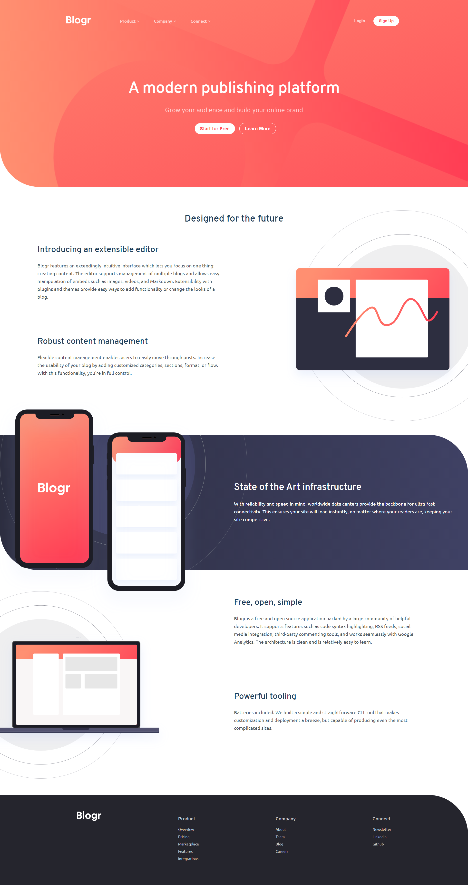

# Frontend Mentor - Blogr landing page solution

This is a solution to the [Blogr landing page challenge on Frontend Mentor](https://www.frontendmentor.io/challenges/blogr-landing-page-EX2RLAApP).

## Table of contents

- [Overview](#overview)
  - [The challenge](#the-challenge)
  - [Screenshot](#screenshot)
  - [Links](#links)
- [My process](#my-process)
  - [Built with](#built-with)
- [Author](#author)
- [Acknowledgments](#acknowledgments)

## Overview

### The challenge

Users should be able to:

- View the optimal layout for the site depending on their device's screen size
- See hover states for all interactive elements on the page

### Screenshot

### Links

- Solution URL: [Github Repository](https://github.com/whoiscaio/blogr-landing-page-main)
- Live Site URL: [Github Pages](https://whoiscaio.github.io/blogr-landing-page-main/)

## My process

### Built with

- Semantic HTML5 markup
- [Sass](https://sass-lang.com/) - Sass Website
- Flexbox
- CSS Grid
- Javascript

## Author

- Frontend Mentor - [@yourusername](https://www.frontendmentor.io/profile/yourusername)
- Github - [whoiscaio](https://github.com/whoiscaio)
- Linkedin - [Caio Lima](https://www.linkedin.com/in/lima-caio/)

## Acknowledgments

This project was very important to consolidate my understanding of CSS Grid, Flexbox and was my very first project made with Sass, i'm very proud of it, even though i didn't used most of the things Sass provide to us.
