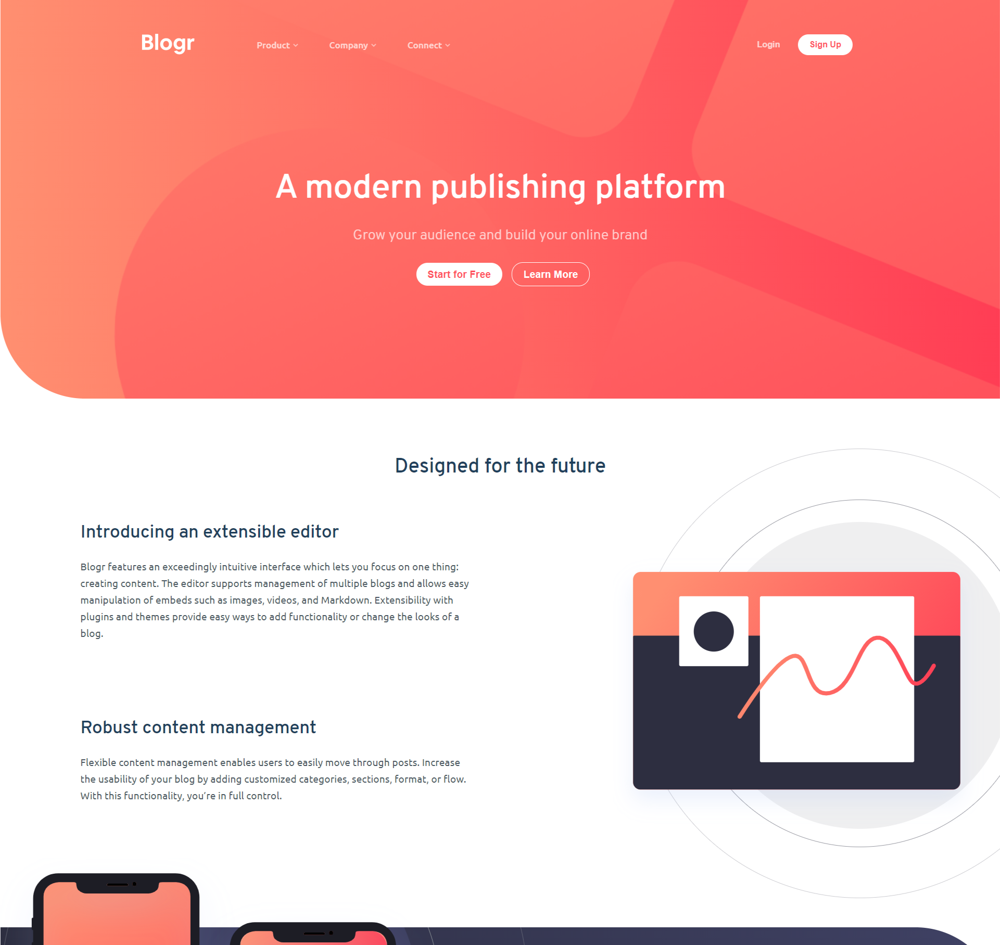
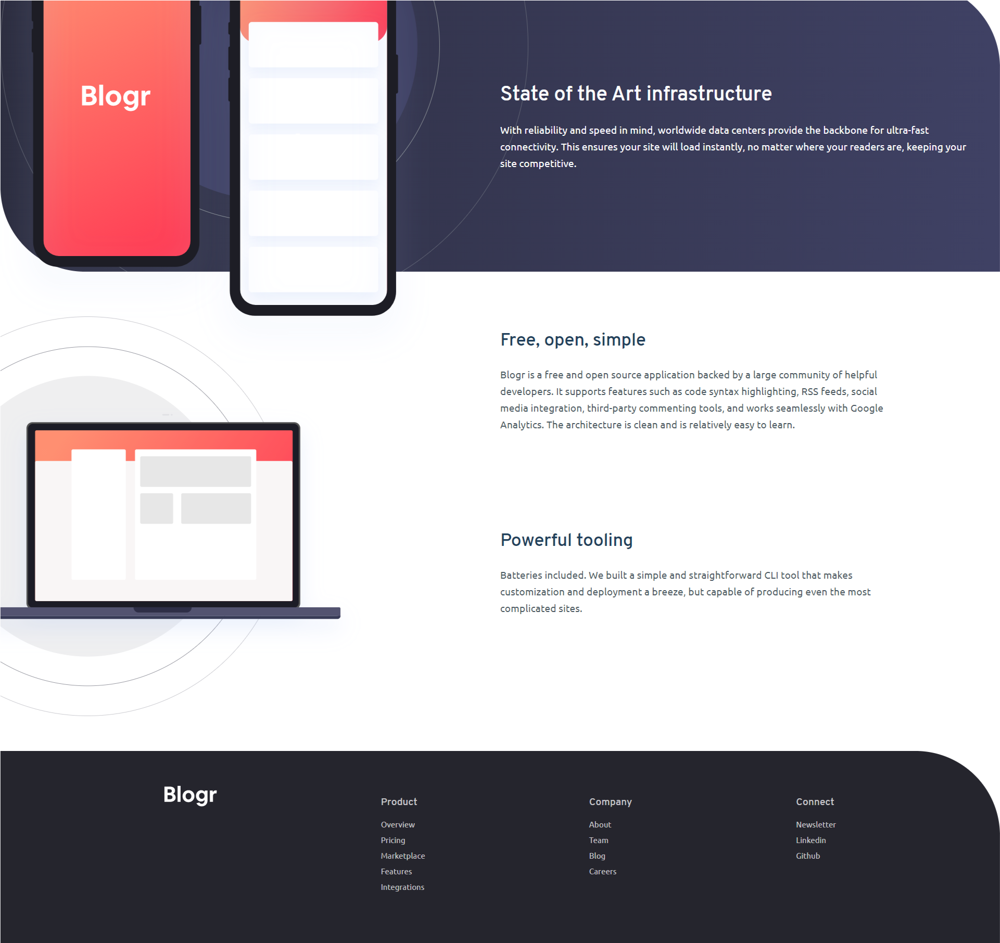

# Blogr Landing Page

Landing page comercial construída para uma plataforma destinada à pessoas que desejam publicar e ampliar a sua marca online.

O propósito da aplicação é exclusivamente exibir o produto e atrair a atenção do público para o mesmo, despertando o interesse para a sua utilidade como uma plataforma de alavancamento digital.

## Índice

- [Screenshots](#screenshots)
- [Links](#links)
- [Para desenvolvedores](#para-desenvolvedores)
  - [Rodando localmente](#rodando-localmente)
  - [Licença](#licença)
### Screenshots

<div>
  
  
</div>

### Links

Visualize a página através desse [link](https://whoiscaio.github.io/blogr-landing-page-main/).


## Para desenvolvedores

### Rodando localmente

Clone o projeto

```bash
  git clone https://github.com/whoiscaio/blogr-landing-page-main
```

Uma vez clonado o projeto, por se tratar de algo construído apenas com HTML, CSS e JS puro, basta executar o arquivo index.html no seu navegador.

### Licença

[MIT](https://choosealicense.com/licenses/mit/)

* Projeto fictício

